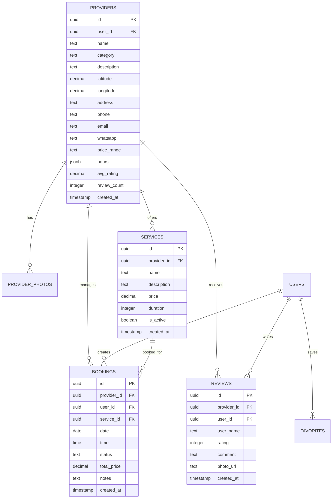

# Database Schema - MVP #3: Marketplace Local

**Version**: 2.1  
**Last Updated**: 2026-01-19  
**Database**: PostgreSQL 15 + PostGIS Extension

---

## 📊 Complete Schema Overview

### Entity Relationship Diagram



---

## 🗂️ Table Definitions

### 1. `providers`
Core provider/business profiles.

```sql
CREATE TABLE providers (
  id UUID PRIMARY KEY DEFAULT gen_random_uuid(),
  user_id UUID REFERENCES auth.users(id) ON DELETE CASCADE,
  name TEXT NOT NULL,
  category TEXT NOT NULL,
  description TEXT,
  latitude DECIMAL(10, 8) NOT NULL,
  longitude DECIMAL(11, 8) NOT NULL,
  address TEXT,
  phone TEXT,
  email TEXT,
  whatsapp TEXT,
  price_range TEXT CHECK (price_range IN ('$', '$$', '$$$', '$$$$')),
  hours JSONB, -- {"monday": {"open": "09:00", "close": "18:00"}, ...}
  avg_rating DECIMAL(3,2) DEFAULT 0 CHECK (avg_rating >= 0 AND avg_rating <= 5),
  review_count INTEGER DEFAULT 0,
  created_at TIMESTAMP DEFAULT NOW(),
  updated_at TIMESTAMP DEFAULT NOW()
);

-- Spatial index for geolocation queries
CREATE INDEX idx_providers_location ON providers USING GIST (
  ll_to_earth(latitude, longitude)
);

-- Regular indexes
CREATE INDEX idx_providers_category ON providers(category);
CREATE INDEX idx_providers_rating ON providers(avg_rating DESC);
CREATE INDEX idx_providers_user_id ON providers(user_id);
```

**Business Rules**:
- One provider profile per user
- Latitude/Longitude required for map display
- Hours stored as JSONB for flexibility
- Price range constrained to 4 tiers

---

### 2. `provider_photos`
Photo gallery for provider portfolios.

```sql
CREATE TABLE provider_photos (
  id UUID PRIMARY KEY DEFAULT gen_random_uuid(),
  provider_id UUID NOT NULL REFERENCES providers(id) ON DELETE CASCADE,
  url TEXT NOT NULL,
  caption TEXT,
  order_index INTEGER DEFAULT 0,
  created_at TIMESTAMP DEFAULT NOW()
);

CREATE INDEX idx_photos_provider ON provider_photos(provider_id, order_index);
```

**Business Rules**:
- Photos deleted when provider deleted (CASCADE)
- `order_index` controls gallery display order
- No duplicate prevention (same photo can appear multiple times)

---

### 3. `services`
Services/offerings that providers sell.

```sql
CREATE TABLE services (
  id UUID PRIMARY KEY DEFAULT gen_random_uuid(),
  provider_id UUID NOT NULL REFERENCES providers(id) ON DELETE CASCADE,
  name TEXT NOT NULL,
  description TEXT,
  price DECIMAL(10,2) NOT NULL CHECK (price >= 0),
  duration INTEGER NOT NULL CHECK (duration > 0), -- Minutes
  is_active BOOLEAN DEFAULT true,
  created_at TIMESTAMP DEFAULT NOW(),
  updated_at TIMESTAMP DEFAULT NOW()
);

CREATE INDEX idx_services_provider ON services(provider_id);
CREATE INDEX idx_services_active ON services(is_active) WHERE is_active = true;
```

**Business Rules**:
- Multiple services per provider allowed
- Price in local currency (configurable)
- Duration in minutes (30, 60, 90, etc.)
- Soft delete via `is_active` flag

---

### 4. `bookings`
Customer reservations/appointments.

```sql
CREATE TABLE bookings (
  id UUID PRIMARY KEY DEFAULT gen_random_uuid(),
  provider_id UUID NOT NULL REFERENCES providers(id) ON DELETE CASCADE,
  user_id UUID NOT NULL REFERENCES auth.users(id) ON DELETE CASCADE,
  service_id UUID NOT NULL REFERENCES services(id) ON DELETE RESTRICT,
  date DATE NOT NULL,
  time TIME NOT NULL,
  status TEXT NOT NULL DEFAULT 'pending' CHECK (
    status IN ('pending', 'confirmed', 'rejected', 'completed', 'cancelled')
  ),
  total_price DECIMAL(10,2) NOT NULL,
  notes TEXT,
  created_at TIMESTAMP DEFAULT NOW(),
  updated_at TIMESTAMP DEFAULT NOW()
);

CREATE INDEX idx_bookings_provider ON bookings(provider_id, status);
CREATE INDEX idx_bookings_user ON bookings(user_id, status);
CREATE INDEX idx_bookings_date ON bookings(date, time);

-- Prevent double-booking same slot
CREATE UNIQUE INDEX idx_bookings_slot ON bookings(provider_id, date, time)
  WHERE status IN ('pending', 'confirmed');
```

**Business Rules**:
- Users can book multiple services
- Providers can accept/reject bookings
- Same time slot cannot be double-booked
- Service deletion restricted if active bookings exist

---

### 5. `reviews`
Customer feedback and ratings.

```sql
CREATE TABLE reviews (
  id UUID PRIMARY KEY DEFAULT gen_random_uuid(),
  provider_id UUID NOT NULL REFERENCES providers(id) ON DELETE CASCADE,
  user_id UUID NOT NULL REFERENCES auth.users(id) ON DELETE CASCADE,
  user_name TEXT NOT NULL,
  rating INTEGER NOT NULL CHECK (rating BETWEEN 1 AND 5),
  comment TEXT,
  photo_url TEXT,
  created_at TIMESTAMP DEFAULT NOW()
);

CREATE INDEX idx_reviews_provider ON reviews(provider_id);
CREATE INDEX idx_reviews_user ON reviews(user_id);

-- One review per user per provider
CREATE UNIQUE INDEX idx_reviews_unique ON reviews(provider_id, user_id);
```

**Business Rules**:
- One review per user-provider pair
- Rating 1-5 stars required
- Comment and photo optional
- Reviews trigger `avg_rating` recalculation

---

### 6. `favorites`
User-saved providers.

```sql
CREATE TABLE favorites (
  id UUID PRIMARY KEY DEFAULT gen_random_uuid(),
  user_id UUID NOT NULL REFERENCES auth.users(id) ON DELETE CASCADE,
  provider_id UUID NOT NULL REFERENCES providers(id) ON DELETE CASCADE,
  created_at TIMESTAMP DEFAULT NOW()
);

CREATE INDEX idx_favorites_user ON favorites(user_id);
CREATE UNIQUE INDEX idx_favorites_unique ON favorites(user_id, provider_id);
```

**Business Rules**:
- No duplicates per user
- Deleted when provider or user deleted

---

## 🔐 Row Level Security (RLS) Policies

### Providers Table

```sql
ALTER TABLE providers ENABLE ROW LEVEL SECURITY;

-- Public can view all providers
CREATE POLICY "providers_select_public"
  ON providers FOR SELECT
  USING (true);

-- Providers can insert their own profile
CREATE POLICY "providers_insert_own"
  ON providers FOR INSERT
  WITH CHECK (user_id = auth.uid());

-- Providers can update only their own
CREATE POLICY "providers_update_own"
  ON providers FOR UPDATE
  USING (user_id = auth.uid())
  WITH CHECK (user_id = auth.uid());

-- Providers can delete only their own
CREATE POLICY "providers_delete_own"
  ON providers FOR DELETE
  USING (user_id = auth.uid());
```

### Services Table

```sql
ALTER TABLE services ENABLE ROW LEVEL SECURITY;

-- Public can view active services
CREATE POLICY "services_select_active"
  ON services FOR SELECT
  USING (is_active = true);

-- Providers can manage own services
CREATE POLICY "services_all_own"
  ON services FOR ALL
  USING (
    provider_id IN (
      SELECT id FROM providers WHERE user_id = auth.uid()
    )
  );
```

### Bookings Table

```sql
ALTER TABLE bookings ENABLE ROW LEVEL SECURITY;

-- Users see their own bookings
CREATE POLICY "bookings_select_user"
  ON bookings FOR SELECT
  USING (user_id = auth.uid());

-- Providers see bookings for their services
CREATE POLICY "bookings_select_provider"
  ON bookings FOR SELECT
  USING (
    provider_id IN (
      SELECT id FROM providers WHERE user_id = auth.uid()
    )
  );

-- Users can create bookings
CREATE POLICY "bookings_insert_user"
  ON bookings FOR INSERT
  WITH CHECK (user_id = auth.uid());

-- Providers can update status of their bookings
CREATE POLICY "bookings_update_provider"
  ON bookings FOR UPDATE
  USING (
    provider_id IN (
      SELECT id FROM providers WHERE user_id = auth.uid()
    )
  )
  WITH CHECK (
    provider_id IN (
      SELECT id FROM providers WHERE user_id = auth.uid()
    )
  );
```

### Reviews Table

```sql
ALTER TABLE reviews ENABLE ROW LEVEL SECURITY;

-- Anyone can read reviews
CREATE POLICY "reviews_select_public"
  ON reviews FOR SELECT
  USING (true);

-- Users can create reviews
CREATE POLICY "reviews_insert_user"
  ON reviews FOR INSERT
  WITH CHECK (user_id = auth.uid());

-- Users can update/delete only own reviews
CREATE POLICY "reviews_update_own"
  ON reviews FOR UPDATE
  USING (user_id = auth.uid());

CREATE POLICY "reviews_delete_own"
  ON reviews FOR DELETE
  USING (user_id = auth.uid());
```

---

## 🔍 Geospatial Queries

### Enable PostGIS Extension

```sql
CREATE EXTENSION IF NOT EXISTS cube;
CREATE EXTENSION IF NOT EXISTS earthdistance;
```

### Find Providers Within Radius

```sql
-- Search providers within 5km radius
SELECT 
  p.*,
  earth_distance(
    ll_to_earth(p.latitude, p.longitude),
    ll_to_earth($user_lat, $user_lng)
  ) AS distance_meters
FROM providers p
WHERE 
  earth_box(ll_to_earth($user_lat, $user_lng), 5000) @> ll_to_earth(p.latitude, p.longitude)
  AND (
    $category IS NULL OR p.category = $category
  )
  AND (
    $rating_min IS NULL OR p.avg_rating >= $rating_min
  )
ORDER BY distance_meters ASC
LIMIT 50;
```

---

## ⚡ Database Triggers

### Auto-update Provider Rating

```sql
CREATE OR REPLACE FUNCTION update_provider_rating()
RETURNS TRIGGER AS $$
BEGIN
  UPDATE providers
  SET 
    avg_rating = (
      SELECT COALESCE(AVG(rating), 0)
      FROM reviews
      WHERE provider_id = NEW.provider_id
    ),
    review_count = (
      SELECT COUNT(*)
      FROM reviews
      WHERE provider_id = NEW.provider_id
    ),
    updated_at = NOW()
  WHERE id = NEW.provider_id;
  
  RETURN NEW;
END;
$$ LANGUAGE plpgsql;

CREATE TRIGGER trigger_update_rating
  AFTER INSERT OR UPDATE OR DELETE ON reviews
  FOR EACH ROW
  EXECUTE FUNCTION update_provider_rating();
```

### Auto-update Timestamps

```sql
CREATE OR REPLACE FUNCTION update_updated_at()
RETURNS TRIGGER AS $$
BEGIN
  NEW.updated_at = NOW();
  RETURN NEW;
END;
$$ LANGUAGE plpgsql;

CREATE TRIGGER trigger_providers_updated_at
  BEFORE UPDATE ON providers
  FOR EACH ROW
  EXECUTE FUNCTION update_updated_at();

CREATE TRIGGER trigger_services_updated_at
  BEFORE UPDATE ON services
  FOR EACH ROW
  EXECUTE FUNCTION update_updated_at();

CREATE TRIGGER trigger_bookings_updated_at
  BEFORE UPDATE ON bookings
  FOR EACH ROW
  EXECUTE FUNCTION update_updated_at();
```

---

## 📈 Performance Optimization

### Recommended Indexes

```sql
-- Composite indexes for common queries
CREATE INDEX idx_bookings_provider_status_date 
  ON bookings(provider_id, status, date DESC);

CREATE INDEX idx_services_provider_active 
  ON services(provider_id, is_active) 
  WHERE is_active = true;

-- Partial indexes for filtered queries
CREATE INDEX idx_pending_bookings 
  ON bookings(provider_id, date, time) 
  WHERE status = 'pending';
```

### Query Optimization Tips

1. **Use covering indexes** for frequently accessed columns
2. **Leverage partial indexes** for status-filtered queries
3. **Enable query plan caching** for geospatial searches
4. **Use materialized views** for analytics (if needed)

---

## 🔄 Migration Strategy

### Initial Setup

```sql
-- Run in order:
1. CREATE EXTENSION earthdistance CASCADE
2. CREATE all tables
3. CREATE all indexes
4. ENABLE RLS on all tables
5. CREATE all RLS policies
6. CREATE triggers
```

### Seed Data (Development)

```sql
-- Insert test provider
INSERT INTO providers (user_id, name, category, latitude, longitude, ...)
VALUES (...);

-- Insert test services
INSERT INTO services (provider_id, name, price, duration, ...)
VALUES (...);
```

---

**Last Updated**: 2026-01-19  
**Schema Version**: 2.1  
**Compatible with**: PostgreSQL 15+, PostGIS 3.3+
