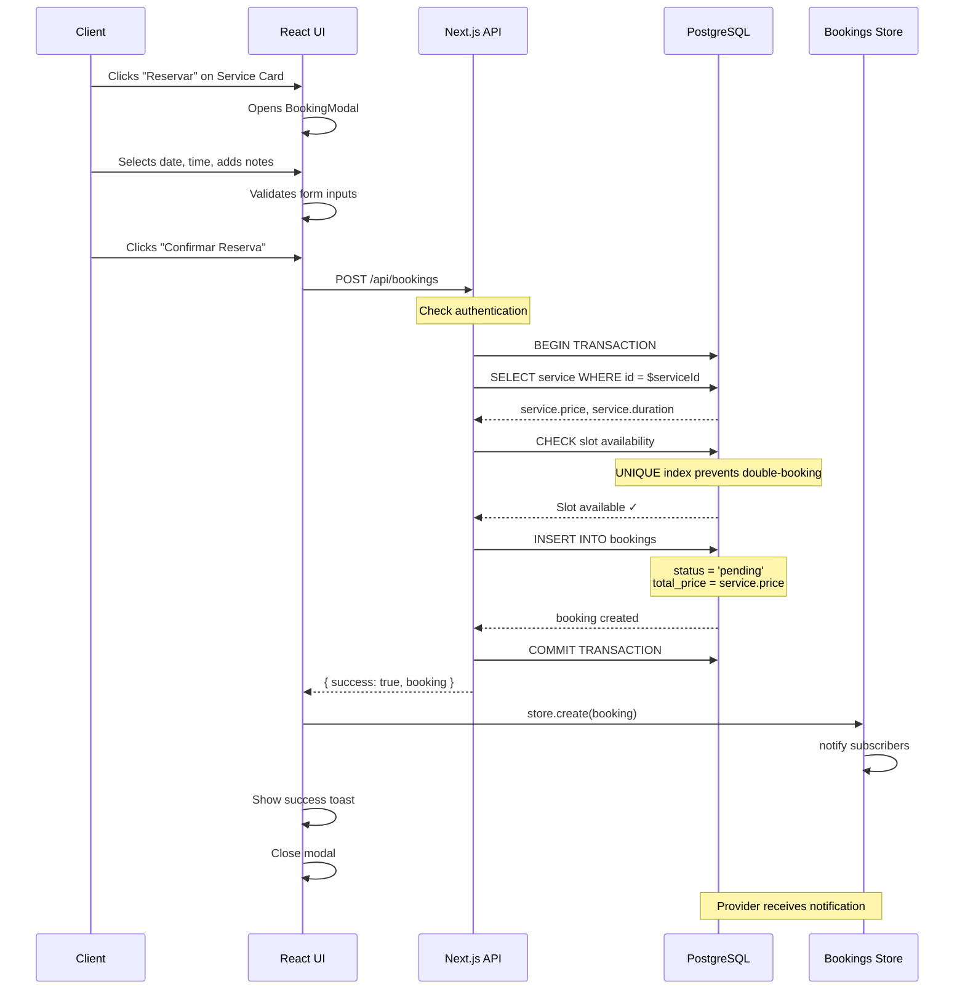
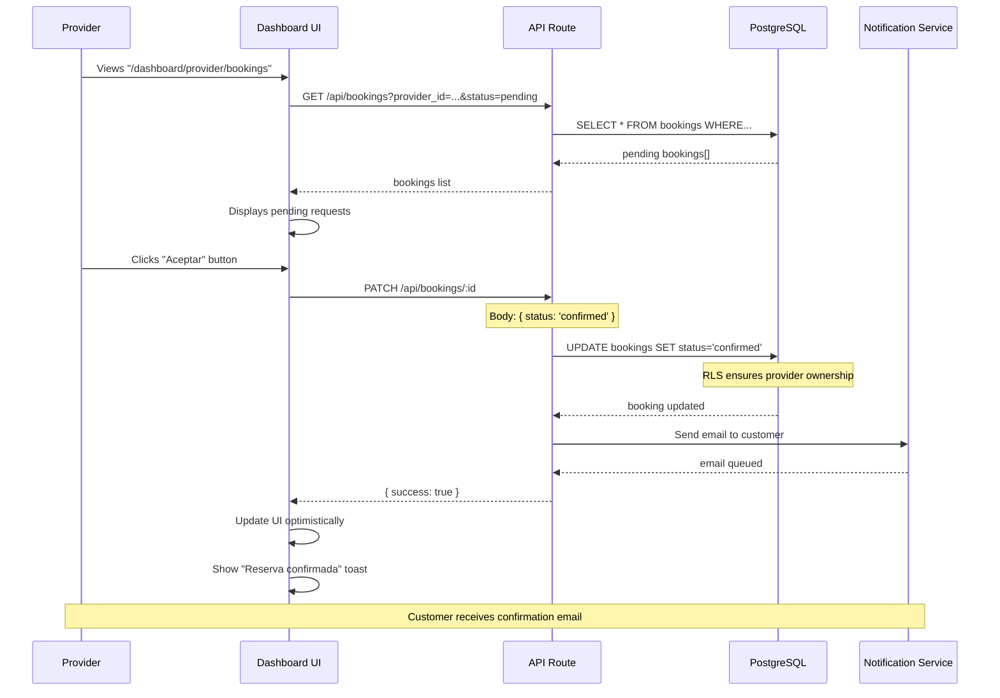
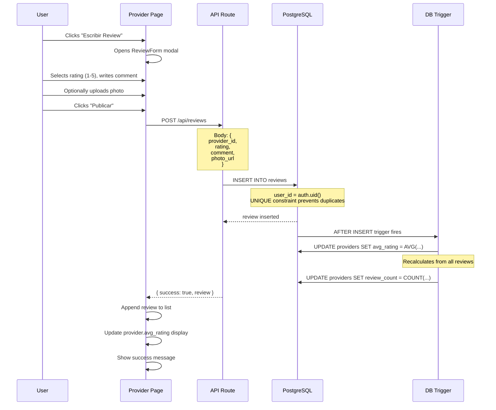
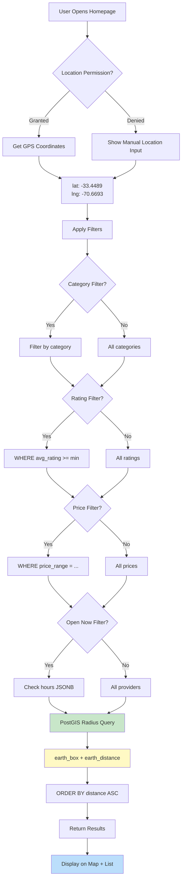
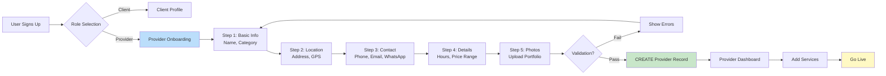
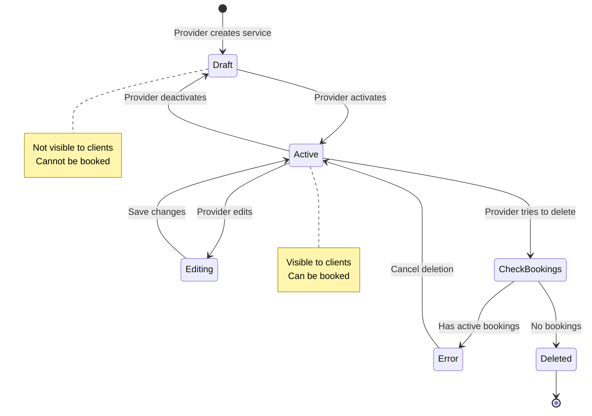
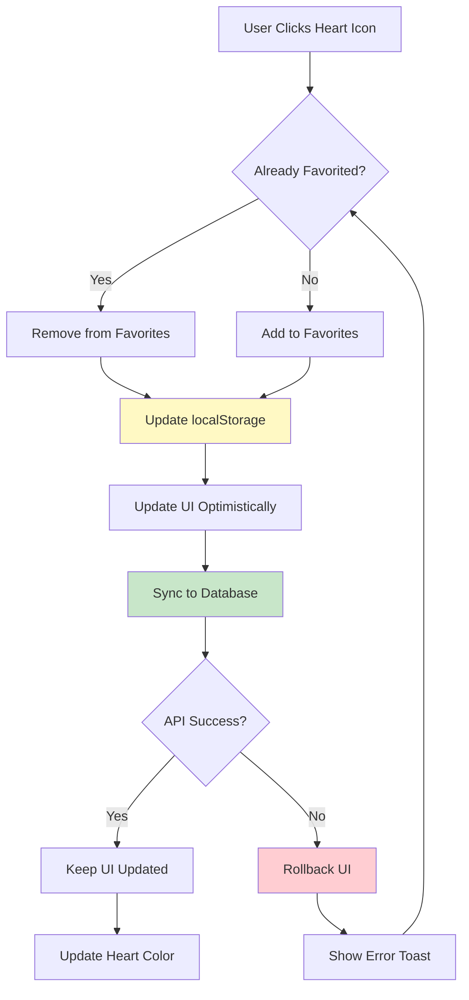

# Data Flow Diagrams - MVP #3: Marketplace Local

**Version**: 2.1  
**Last Updated**: 2026-01-19

---

## 🔄 Complete System Flows

### 1. Booking Creation Flow



**Key Decision Points**:
1. **Slot Availability**: UNIQUE index on `(provider_id, date, time)` ensures no double-booking
2. **Price Lock**: Total price copied from service at booking time (protects from price changes)
3. **Transaction**: Ensures atomic operation (all-or-nothing)

---

### 2. Provider Accepts Booking Flow



**RLS Security**:
```sql
-- Only provider can update their bookings
USING (
  provider_id IN (
    SELECT id FROM providers WHERE user_id = auth.uid()
  )
)
```

---

### 3. Review Submission + Rating Recalculation



**Trigger Implementation**:
```sql
CREATE TRIGGER trigger_update_rating
  AFTER INSERT OR UPDATE OR DELETE ON reviews
  FOR EACH ROW
  EXECUTE FUNCTION update_provider_rating();
```

**Why Trigger?**:
- ✅ Ensures `avg_rating` always consistent
- ✅ Atomic with review creation
- ✅ No race conditions
- ✅ Works for INSERT/UPDATE/DELETE

---

### 4. Geolocation Search Flow



**Query Optimization**:
```sql
-- Spatial index makes this O(log n)
CREATE INDEX idx_providers_location 
  ON providers USING GIST (
    ll_to_earth(latitude, longitude)
  );
```

---

### 5. Provider Onboarding Flow



**Validation Rules**:
- ✅ Name: 3-100 characters
- ✅ Category: Must be from predefined list
- ✅ Location: Valid lat/lng or geocodable address
- ✅ Phone: Valid format
- ✅ Hours: Valid time ranges (open < close)

---

### 6. Service Management (CRUD) Flow



**State Transitions**:
```typescript
// Soft delete if no active bookings
const canDelete = async (serviceId: string) => {
  const { count } = await supabase
    .from('bookings')
    .select('id', { count: 'exact', head: true })
    .eq('service_id', serviceId)
    .in('status', ['pending', 'confirmed'])
  
  return count === 0
}
```

---

### 7. Favorites Sync Flow



**Optimistic Update Pattern**:
```typescript
const toggleFavorite = async (providerId: string) => {
  // 1. Update UI immediately
  setIsFavorite(!isFavorite)
  
  try {
    // 2. Sync to backend
    if (isFavorite) {
      await supabase.from('favorites').delete(...)
    } else {
      await supabase.from('favorites').insert(...)
    }
  } catch (error) {
    // 3. Rollback on error
    setIsFavorite(isFavorite)
    toast.error('Failed to update favorite')
  }
}
```

---

## 🎯 System Architecture Patterns

### Observable Store Pattern

```typescript
class Observable<T> {
  private listeners = new Set<(data: T) => void>()
  
  subscribe(listener: (data: T) => void) {
    this.listeners.add(listener)
    return () => this.listeners.delete(listener)
  }
  
  protected notify(data: T) {
    this.listeners.forEach(fn => fn(data))
  }
}

class BookingsStore extends Observable<Booking[]> {
  private bookings: Booking[] = []
  
  async load() {
    const data = await fetchBookings()
    this.bookings = data
    this.notify(data)
  }
  
  async create(booking: CreateBookingRequest) {
    const newBooking = await createBooking(booking)
    this.bookings.push(newBooking)
    this.notify(this.bookings)
  }
}
```

**Benefits**:
- ✅ Single source of truth
- ✅ Automatic UI updates
- ✅ Easy to test
- ✅ Decoupled from UI framework

---

## 📊 Performance Considerations

### Database Query Optimization

```sql
-- Bad: N+1 queries
SELECT * FROM bookings; -- 100 results
-- Then for each booking:
SELECT * FROM services WHERE id = booking.service_id; -- 100 queries

-- Good: Single JOIN query
SELECT 
  b.*,
  s.name as service_name,
  s.duration as service_duration
FROM bookings b
JOIN services s ON b.service_id = s.id
WHERE b.provider_id = $1;
```

### Caching Strategy

```typescript
// Cache provider profiles (1 hour TTL)
const getProvider = async (id: string) => {
  const cached = cache.get(`provider:${id}`)
  if (cached) return cached
  
  const fresh = await db.providers.findById(id)
  cache.set(`provider:${id}`, fresh, 3600)
  return fresh
}

// Invalidate on update
const updateProvider = async (id: string, data: any) => {
  await db.providers.update(id, data)
  cache.delete(`provider:${id}`)
}
```

---

**Last Updated**: 2026-01-19  
**Version**: 2.1
