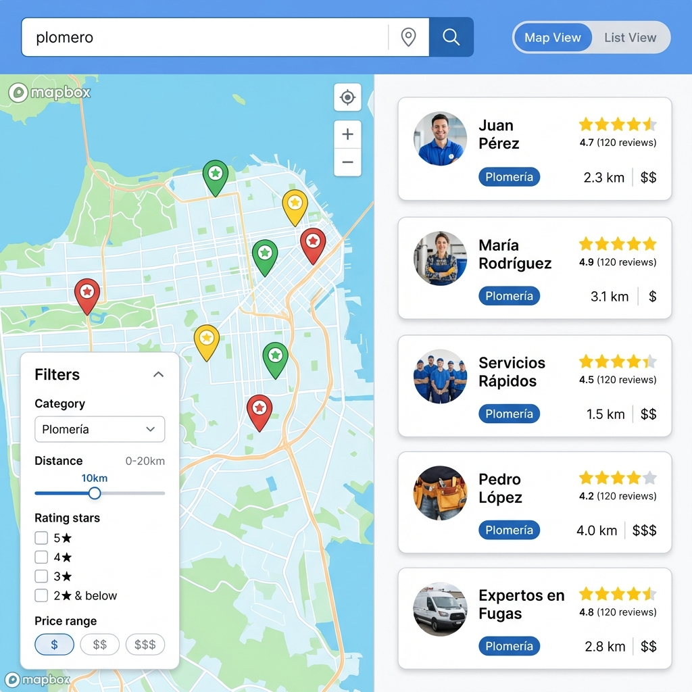
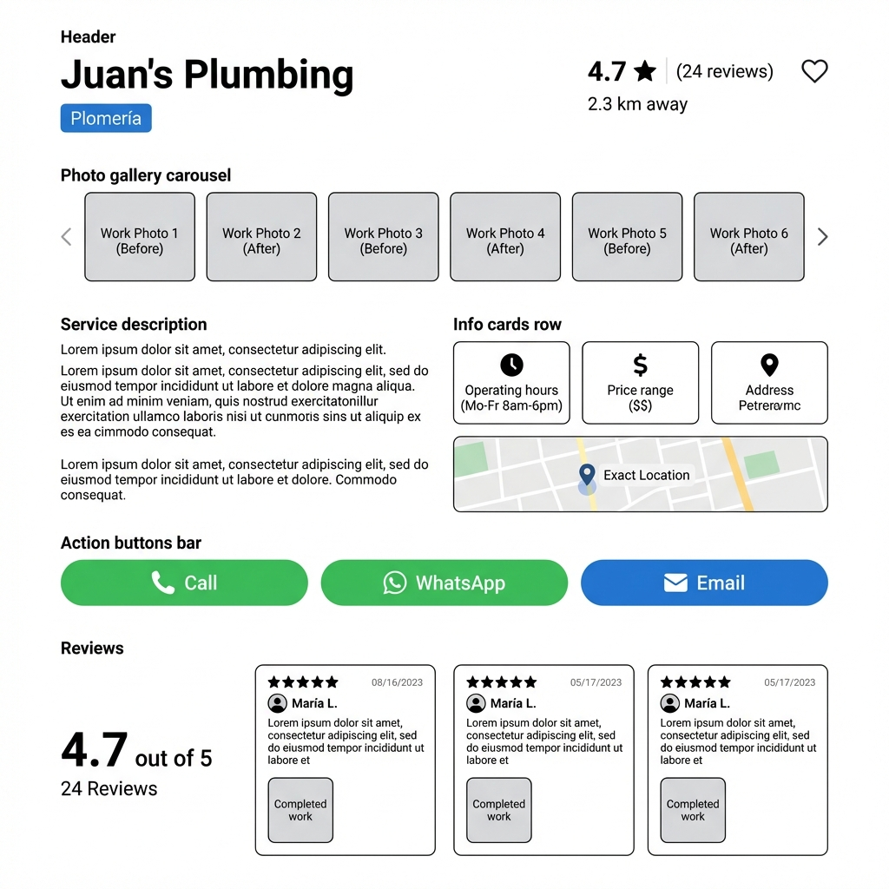
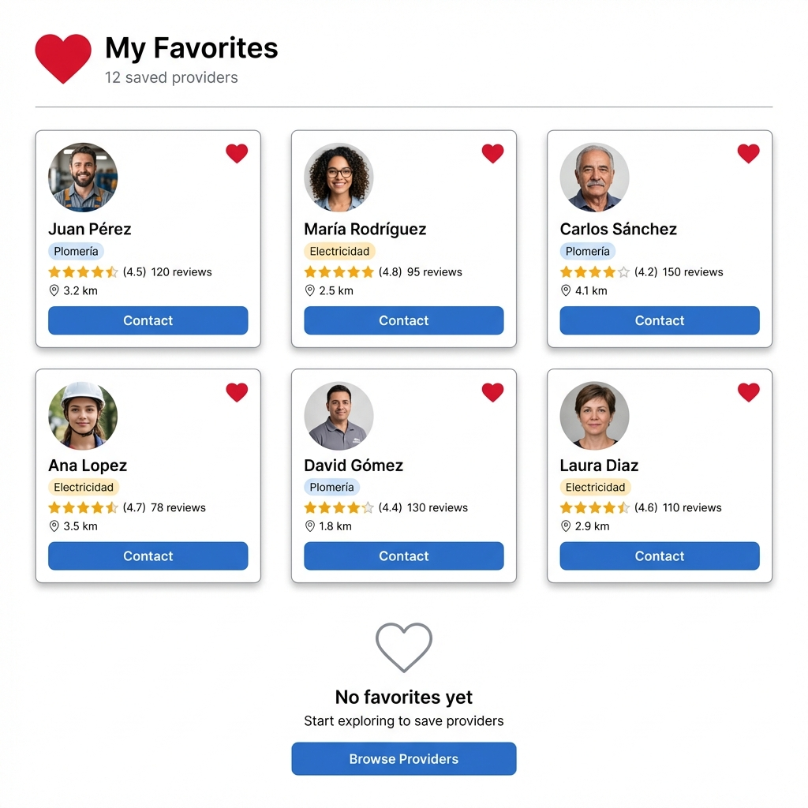

# Wireframes - MVP #3: Marketplace Local

## 1. Search Page (Map + List View)

**Layout**:
- Top: Search bar con geolocation icon
- Left (60%): Mapbox map con markers
- Right (40%): List view con provider cards
- Toggle button: "Map" / "List" view
- Filter sidebar (collapsible): Category, Distance slider, Rating, Price

**Interactions**:
- Click marker → popup → click popup → provider detail
- Click card → provider detail
- Drag map → update results
- Adjust filters → re-query

---

## 2. Provider Profile

**Layout**:
- Header: Name, category badge, avg rating (4.7★), distance, heart icon (favorite)
- Photo gallery carousel (6 photos)
- Description section
- Info cards: Hours, Price range, Address
- Map showing exact location
- Action buttons row: Call, WhatsApp, Email
- Reviews section: Avg rating, review cards with stars + comment + photo

---

## 3. Write Review Modal

**Layout**:
- Modal title "Write Review for [Provider Name]"
- Star rating selector (1-5 stars, clickable)
- Textarea for comment (max 500 chars)
- Photo upload (optional, drag-and-drop)
- Footer: Cancel (gray), Submit (blue)

---

## 4. Favorites Page

**Layout**:
- Page title "My Favorites"
- Grid of provider cards (3 columns)
- Each card: photo, name, category, rating, distance, heart icon (filled)
- Empty state: "No favorites yet. Start exploring!"

---

## Responsive Behavior

- **Desktop**: Map + List side-by-side
- **Tablet**: Stacked, map above list
- **Mobile**: Toggle between map/list, filter drawer

---

## Accessibility

- ARIA labels for map markers
- Keyboard navigation for filters
- Screen reader announces distance and rating
- High contrast mode for map

---

**Last Updated**: 2026-01-14  
**Images**: 3/4 (Write Review Modal pending)
